# HelloWorld-VS_BB
 Visual Scripting and Behavior Tree's integration Hello World for Unity Version 2023.2.5f1

Download the UnityPackage from Releases

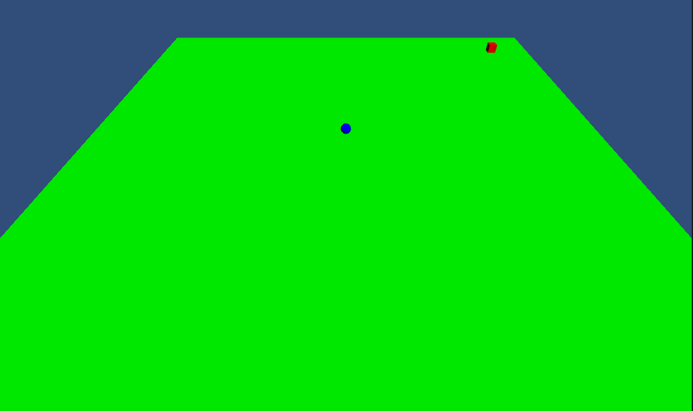
# What is in this package

Inside this package you can find a brief example of the capabilities of the integration_BB_VS tool.

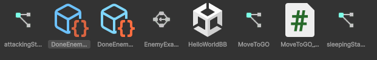

The example in HelloWorldBB scene, consist of a simple behavior for an Enemy with 2 different behaviors trees, one for chasing the player and another for night routine.

The behavior trees are controlled by an upper state machine which decides which tree will be running according to a simple rule of day and night.

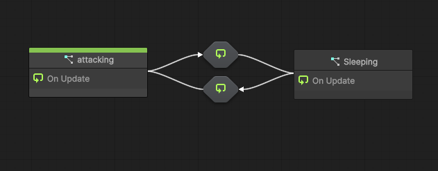

## Attacking State

The attacking state contains an VS_BBTreeExecutor with their corresponding behavior "DoneEnemyBehavior", each of the necessary parameters for the execution are exposed and are provided here to the node.
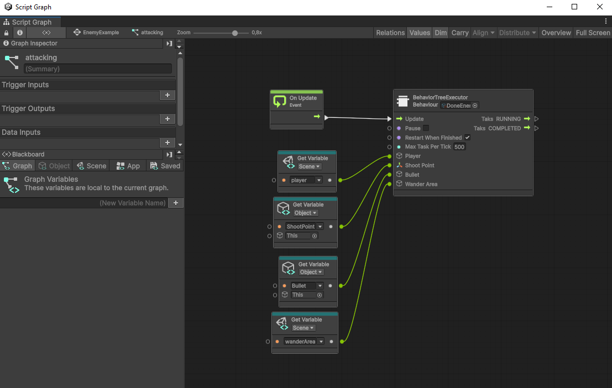
 
The behavior is a sightly modification of the BB example behaviors "DoneEnemyBehavior"

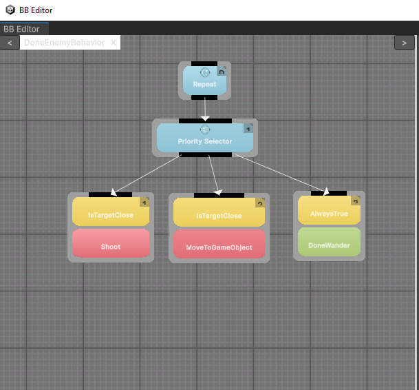
 
 ## Sleeping State

The sleeping state contains a VS_BBTreeExecutor with the behavior "DoneEnemySleep", in contrast to "DoneEnemyBehavior",

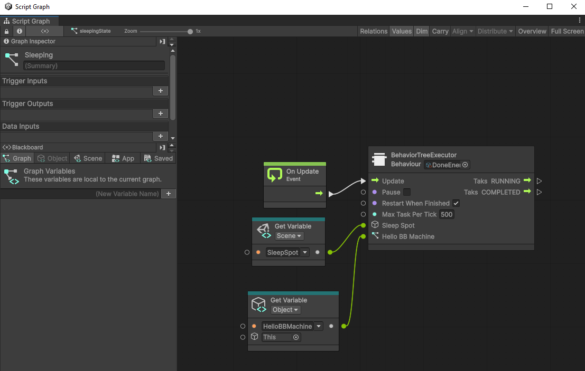

### HelloBB Node

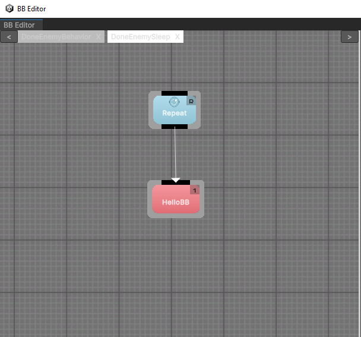
 this behavior is formed uniquely by a single node "HelloBB", this node is a custom node created through the VSExecutorEditor 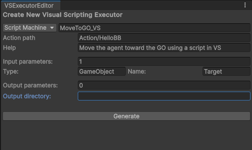, this window generate code for a node usable in BB capable of executing a Script Machine or State Machine, and sending and receiving any parameters specified. It will however always need a GameObject with the component VisualScript Machine os Visual State Machine to be provided in their variables.

### DoneEnemySleep

For setting the behavior "DoneEnemySleep", it is gonna need their parameters exposed to the blackboard, select the node and create each parameter giving it a name 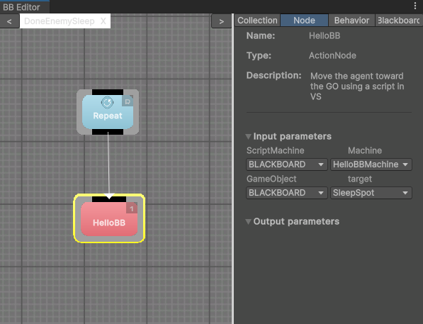, in their corresponding way "In/Out".
 
Select the BlackBoard window and in the case for this behavior, the parameters option will only be "In" 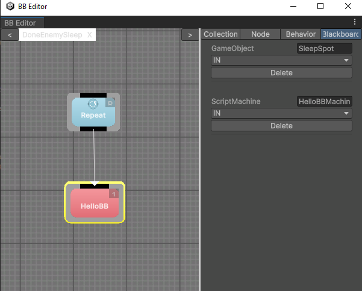

### MoveToGO visual script

As a prove of concept it has been recreated in Visual Scripting the behavior node to Move an Agent to another designated GO.
This is the script that is being used in the behavior tree "DoneEnemySleep" through the "HelloBB" behavior node.

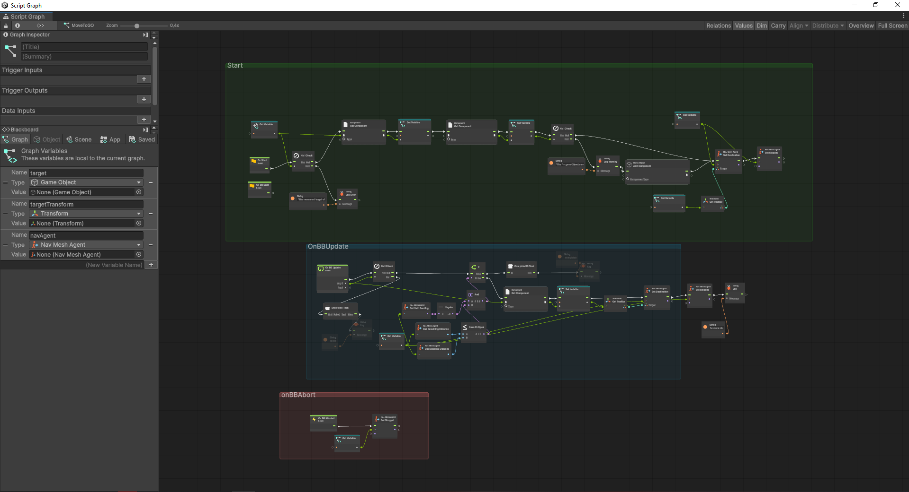

This script utilizes the BB-->VS and VS-->BB communication custom nodes to recreate the function of a node of BB.
In brief it uses "OnBBUpdate" to start the flow of the graph and receive any parameter in the same order as they are provided to the BB node. Then it is the rest of the code in visual scripting.

Other cases you can find in this example is the "OnStart" and "OnAbort" this last is exclusive to the functioning of BB nodes, see more on documentation for BehaviorBricks.

Lastly, any behavior made in Visual Scripting is gonna need a GO whit their corresponding component for their executor Machine. here "MoveToGO" is in a Script Machine, and its reference has to be provided to the Behavior Tree Executor for it to run it.

In this example it is set as one of the object variable for the Graph.
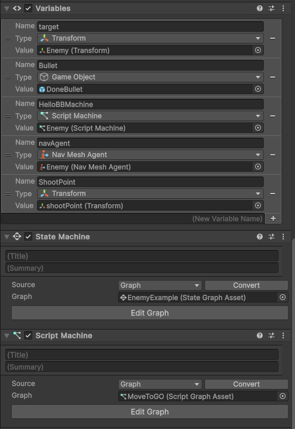